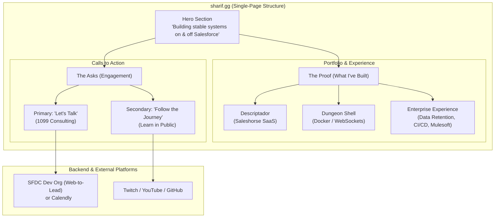

---

### [Header Section]

**Sharif** | Senior Full-Stack Developer

---

### [Hero Section]

**Headline:** Building stable systems on and off the Salesforce platform.  
**Sub-headline:** I’m a Senior Full-Stack Developer with 7.5+ years of experience. I help teams untangle technical debt, implement real CI/CD pipelines, and connect Salesforce to the modern web.

---

### [The Proof: Portfolio & Projects]

_Section Intro: I like to treat Salesforce like actual software, not just a declarative database. When I'm not writing Apex, I'm usually building full-stack apps or messing with containerization._

**Project 1: Descriptador (A Saleshorse Product)**

- **The Pitch:** An app built to solve a simple but incredibly annoying problem: undocumented Salesforce orgs.
- **How it works:** It connects to a Salesforce environment via the Metadata API, flags custom objects and validation rules missing descriptions, and uses AI to auto-generate them in bulk.
- **The Tech:** Full-stack web app, Salesforce REST/Metadata APIs, LLM integration.

**Project 2: Dungeon Shell**

- **The Pitch:** A web-based game designed to help users learn CLI commands.
- **How it works:** It doesn't just simulate a terminal—it connects to an actual Linux terminal exposed via Docker and WebSockets.
- **Why I built it:** Because I love infrastructure and wanted an excuse to experiment with real-time bidirectional communication and containerization outside of the CRM ecosystem.

**The 9-to-5: Enterprise Experience**

- **The Pitch:** I am currently the sole Salesforce developer at a credit union, acting as the bridge between standard CRM administration and modern software engineering.
- **Recent Wins:**
  - Architected a complex data retention framework utilizing TypeScript LWCs, the Metadata API, Queueables, and Batches.
  - Built custom integrations to process and manipulate real-time Mulesoft JSON payloads.
  - Currently championing the team's transition away from manual change sets and into source-driven development (Git, GitHub Actions CI/CD, and TS/Apex linting).

---

### [The Asks: Calls to Action]

_(Visually, split these into two distinct blocks side-by-side or stacked cleanly)_

**Block 1: Let's Build Something (Consulting / 1099)**  
I am available for select 1099 consulting and technical partnerships. I specialize in helping Architects and teams execute complex visions. If you need a thorough code review, a custom AWS/Node integration, or want to finally get your org on a modern CI/CD pipeline, let's talk.  
**[Button: Book a Technical Chat]** _(Links to Calendly or your custom Web-to-Lead form)_

**Block 2: Learn in Public (Follow the Journey)**  
No newsletters or "5-step guru guides" here. I'm currently exploring the world of private, air-gapped AI homelabs (Docker, Ollama, pgvector) and sharing what I learn along the way. Sometimes I know exactly what I'm doing; sometimes I'm figuring it out live. Come watch me break things and fix them.  
**[Icons/Links: Twitch | YouTube | GitHub]**
